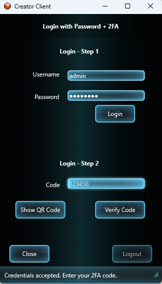
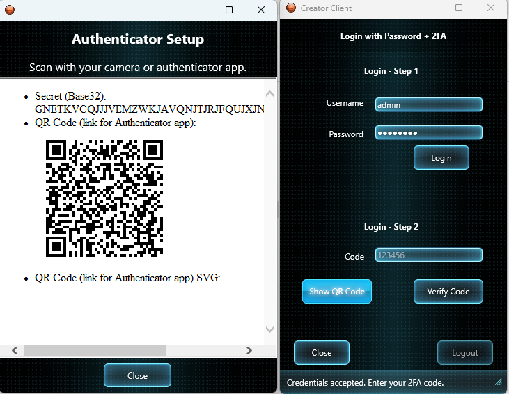
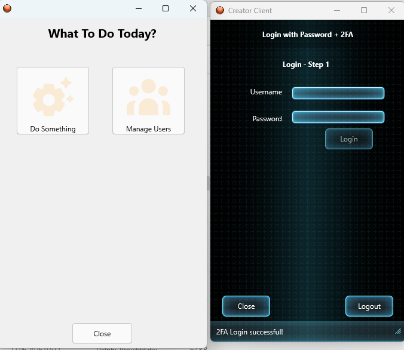
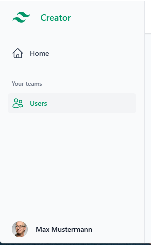

# TailwindcssDemo

A complete **server-rendered web application** built with MARS-Curiosity: users sign in against a
database, confirm a time-based one-time password, and land on a styled dashboard where they can
browse and manage users. Every page is rendered on the server with **WebStencils**, updated in place
with **htmx**, and styled with **Tailwind CSS**.

Where the other demos each isolate one feature, this one shows how they compose into a single
application.

## What it demonstrates

| Feature | Where to look |
| --- | --- |
| **DB-backed login** — credentials verified against a FireDAC-queried `USERS` table (SHA-256 password hashes) | `Server.Resources.Web.Auth.pas` → `AuthenticateUser` |
| **JWT token auth** — token built server-side and carried in an HTTP-only cookie | `Server.Resources.Web.Auth.pas` → `SetAuthCookie`, `Server.Resources.Token.pas` |
| **Two-step authentication** — the token issued after the password check carries an `mfa_pending` claim, and only TOTP verification clears it | `Server.Security.UserPolicy.pas` → `IsFullyAuthenticated` |
| **OTP / TOTP** — RFC 6238 codes compatible with Microsoft / Google Authenticator, with QR-code provisioning | `Utils.OTP.pas`, `Utils.QRCode.pas`, `Server.Resources.OTP.pas` |
| **WebStencils templates** — layouts, pages and partials rendered from Pascal objects | `templates/`, `Server.Services.WebRender.pas`, `Server.Web.Models.pas` |
| **htmx** — form posts and partial page updates without a SPA framework, driven by `HX-Redirect` response headers | `templates/pages/login.html`, `templates/pages/users/` |
| **Tailwind CSS** — utility-first styling, including classes chosen server-side in Delphi | `src/input.css`, `www/css/output.css`, `Server.Web.Models.pas` → `NavStateClass` |
| **Static file serving** — compiled CSS/JS served straight from disk | `Server.Resources.Web.Static.pas` |
| **OpenAPI 3 / Swagger UI** | `Server.Resources.OpenAPI.pas` |

## Requirements

- RAD Studio / Delphi with the MARS-Curiosity library (see [Installation](https://andrea-magni.github.io/MARS/guide/installation)).
- **Microsoft SQL Server** (Express is fine). The demo's schema and seed data are written for
  T-SQL; the connection is configured in `bin/TailwindcssDemoServerApplication.ini`.
- An authenticator app (Microsoft Authenticator, Google Authenticator, …) to complete the
  second factor.

## Setup

1. Create an empty database (the `.ini` expects one named `testDB`) and run the two scripts in
   `database/` against it, in order:

   ```
   database/create_tables_MSSQL.sql
   database/insert.sql
   ```

2. Adjust the FireDAC section of `bin/TailwindcssDemoServerApplication.ini` to match your server:

   ```ini
   FireDAC.MAIN_DB.DriverID=MSSQL
   FireDAC.MAIN_DB.Database=testDB
   FireDAC.MAIN_DB.Server=localhost\SQLEXPRESS
   FireDAC.MAIN_DB.OSAuthent=Yes
   ```

3. Build and run `TailwindcssDemoServerApplication.dproj`, then press **Start** in the server form.

## Run it

Open the sign-in page:

```
http://localhost:8080/rest/default/app/login
```

Seeded demo accounts all use the password `password` — for example `admin` (Max Mustermann),
`j.schmidt` (Julia Schmidt) or `viewer01`. `s.rossi` is deliberately inactive, so it is rejected at
login.

After the password step you are redirected to the OTP page. On first sign-in, open
`/app/otp/qrcode` to scan the provisioning QR code into your authenticator app, then enter the
6-digit code to complete authentication and reach the dashboard.






### Endpoints

| URL | What it serves |
| --- | --- |
| `/rest/default/app/login` | sign-in page (HTML) |
| `/rest/default/app/otp`, `/app/otp/qrcode` | second factor and QR provisioning |
| `/rest/default/app/home` | dashboard, once fully authenticated |
| `/rest/default/users`, `/users/{id}` | user list and detail pages (HTML) |
| `/rest/default/token` | JWT token resource (REST) |
| `/rest/default/user`, `/user/all`, `/user/{id}` | user CRUD (REST/JSON) |
| `/rest/default/otp/generate/{username}`, `/otp/verify/{username}/{otp}` | OTP resource (REST/JSON) |
| `/rest/default/static/{*}` | compiled CSS and JS |
| `/rest/default/openapi` | OpenAPI 3 document / Swagger UI |

## Rebuilding the Tailwind CSS

`www/css/output.css` is committed, so the demo runs as-is and Tailwind is **not** required to build
or run it. To change the styling, edit the templates and regenerate the stylesheet with the
[Tailwind standalone CLI](https://github.com/tailwindlabs/tailwindcss/releases) (no Node.js needed):

```bash
tailwindcss -i src/input.css -o www/css/output.css --config tools/tailwind.config.js --minify
```

Add `--watch` instead of `--minify` while developing. The tutorial explains how to wire this into a
RAD Studio post-build event.

## Third-party assets

- **htmx** (`www/js/htmx.min.js`) — 0BSD licence, bundled.
- **DelphiZXIngQRCode** (`ThirdParty/`) — QR-code generation; see `ThirdParty/LICENSE.md`.
- **@tailwindplus/elements** — powers the interactive dropdowns and the mobile menu in the sidebar
  and topbar partials. It is distributed under a **proprietary Tailwind Plus licence** and is
  therefore *not* bundled here. `templates/layouts/application.html` carries a commented-out CDN
  reference: uncomment it if you hold a licence. Without it, the pages render and Tailwind styling
  works — only some menus stay static.

## Full tutorial

A step-by-step walkthrough — installing the Tailwind CLI, the folder layout, the build step,
serving static files from MARS, choosing classes from Delphi, and the WebStencils syntax rules that
matter — is in the documentation:

**[Tailwind CSS for Delphi developers](https://andrea-magni.github.io/MARS/demos/tailwindcss-tutorial)**
