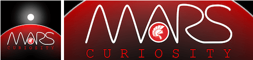

# Delphi REST Library

1. Lightweight
1. Easy and powerful
1. 100% RESTful Web Service
1. Delphi-like
1. Advanced dataset support with FireDAC
1. OpenAPI 3 support 

[More features ...](./docs/MainFeatures.md)

📖 **Read the documentation: [andrea-magni.github.io/MARS](https://andrea-magni.github.io/MARS/)**

# Installation

1. Just run [the setup of the latest release](https://github.com/andrea-magni/MARS/releases/latest)

# Manual Installation

1. Clone or download this project
1. Add folders to RAD Studio Library Path
1. Build All in the RAD Studio IDE
1. Install two packages

[More about the installation ...](docs/Installation.md)

# Get started

### Bootstrap with MARSCmd
Check out [MARSCmd utility](Utils/Source/MARScmd). Compile and run MARSCmd to have your first MARS project up and running in just few a clicks.

# Documentation

* 📖 **[MARS Documentation Site](https://andrea-magni.github.io/MARS/)** — guide, server & client reference, features and demos
* [Andrea Magni Blog](http://www.andreamagni.eu)
* [More demos and templates](./docs/Demos.md)

The documentation site is built with [VitePress](https://vitepress.dev/) from the [`docs/`](./docs) folder and is published automatically to GitHub Pages on every change.

## Forum

Official MARS Curiosity forum at [Delphi-Praxis International](https://en.delphipraxis.net/forum/34-mars-curiosity-rest-library/)

# Contribution

It would be great if you would like to support this project. It's quite easy, and you can become better at Git, too.

* [See Contribution Guide](./CONTRIBUTING.md)

# Thanks

Most of the code has been written by the author (Andrea Magni) with some significant contributions by Nando Dessena, Stefan Glienke and Davide Rossi. Some of my customers actually act as beta testers and early adopters. I want to thank them all for the trust and effort.

# Related Links
Embarcadero Delphi is a modern, powerful and effective language and development tool. Learn more about it at the following links:
 * https://www.embarcadero.com/
 * https://learndelphi.org/

# COPYRIGHTS

* The Delphi stylized helmet icon is trademark of Embarcadero Technologies.
