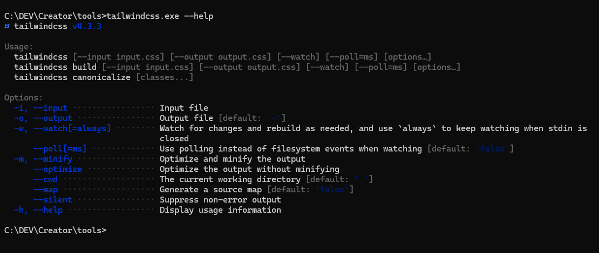
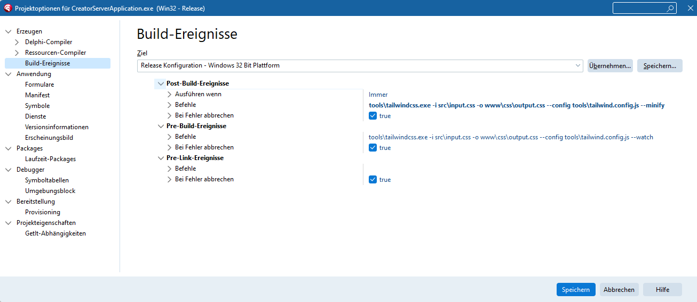
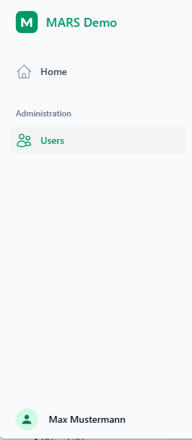

# Tailwind CSS for Delphi developers

*A beginner's guide to styling MARS web apps.*

This tutorial walks a Delphi developer through setting up [Tailwind CSS](https://tailwindcss.com/) in
a MARS-Curiosity web project that renders its pages with WebStencils. No prior front-end experience
is assumed: every new term is explained the first time it appears, and every example is taken from
the [TailwindcssDemo](https://github.com/andrea-magni/MARS/tree/master/Demos/TailwindcssDemo)
project, which you can build and run while reading.

## What you'll need, and what the words mean

- **Tailwind CSS** — a library of small, reusable style "recipes" (classes such as
  `text-emerald-600`) that you attach directly to HTML tags instead of writing custom CSS rules.
- **CLI (command-line interface)** — a small program you run from a terminal, much like running
  `dcc32.exe` to compile a Delphi project, except this one compiles CSS.
- **Standalone CLI** — a build of the Tailwind CLI that needs no Node.js or npm: a single `.exe`,
  which is what most Delphi developers want.
- **Static files** — plain files (CSS, JS, images) served exactly as they are on disk, with no
  server-side processing.
- **WebStencils** — Embarcadero's server-side template engine. It merges data from Pascal objects
  into `.html` templates, much as a Delphi report template merges data into a printed document.
- **Post-build event** — a command RAD Studio runs automatically right after a successful compile.

## Why combine Tailwind with MARS and WebStencils

**MARS** is the REST/HTTP framework that receives the browser's request and calls a Pascal method.
That method returns HTML by way of a small helper class, `TWebRenderService`, which uses
**WebStencils** to fill placeholders such as `@page.Title` with real data. Tailwind's job is purely
visual: it supplies ready-made CSS classes so the result looks finished without hand-writing
stylesheets.

::: tip Reference material
Embarcadero has an official video and demo project covering this same combination:

- Video: [WebStencils + TailwindCSS](https://www.youtube.com/watch?v=NGYIF_CjEgo)
- Demo project: [Embarcadero/WebStencilsDemos (TailwindCSSBased)](https://github.com/Embarcadero/WebStencilsDemos/tree/main/FeatureDemos/Delphi/TailwindCSSBased)
:::

## Installing the Tailwind standalone CLI

Tailwind's CLI is normally installed through npm. Because most Delphi machines have no Node.js
set up, use the standalone build instead — a single executable with no dependencies.

1. Open the [releases page](https://github.com/tailwindlabs/tailwindcss/releases).
2. Download the executable for your platform (for example `tailwindcss-windows-x64.exe`).
3. Rename it to `tailwindcss.exe` and put it in your project, next to the other build tools —
   think of it like copying a `.dll` next to your executable. The demo's committed
   `www/css/output.css` was generated with **v4.3.3**; use that version if you want a
   byte-comparable rebuild. The CLI is not committed to the repository — it is a ~107 MB
   binary, over GitHub's per-file limit — so this download is a one-time setup step.

   ::: tip
   The Tailwind CLI is only needed to *change* the styling. The compiled stylesheet ships
   with the demo, so you can build and run it without downloading anything.
   :::
4. Open a command prompt in that folder and run:

```bash
tailwindcss.exe --help
```

If a list of commands appears, the CLI works. There is no installer and no setup wizard.



## Setting up the folder structure

Create these folders alongside the Delphi project. This is the layout `TailwindcssDemo` uses:

```
Demos/TailwindcssDemo/
  src/
    input.css            <- you write this
  www/                   <- served as /static/... by MARS
    css/
      output.css         <- Tailwind generates this
    js/
      htmx.min.js
  templates/
    layouts/
      application.html
    partials/
      sidebar.html
      topbar.html
    pages/
      users/
        list.html
        detail.html
  bin/                   <- the compiled server lives here
```

Two details are worth pausing on, because they are what make the layout portable:

- `www` and `templates` sit **next to** `bin`, and both are located at run time relative to the
  executable — so the demo works wherever the repository is checked out.
- The folder on disk is `www/css`, while the URL the browser requests is `/static/css` — the
  static resource maps one onto the other.

## Your first Tailwind input file

Create `src/input.css` with a single line:

```css
@import "tailwindcss";
```

This is the equivalent of a `uses` clause that pulls in an entire library: it tells Tailwind to
include its utility classes.

## Compiling CSS (the build step)

This works exactly like compiling Delphi code: source in, compiler runs, output the runtime — here,
the browser — can consume.

```bash
tailwindcss.exe -i src/input.css -o www/css/output.css --config tools/tailwind.config.js --watch
```

| Flag | Meaning |
| --- | --- |
| `-i` | input file — your Tailwind source |
| `-o` | output file — the compiled CSS the browser loads |
| `--config` | the Tailwind config file to use |
| `--watch` | recompiles automatically every time you save a change |

For a release build, run once with `--minify` instead of leaving `--watch` running:

```bash
tailwindcss.exe -i src/input.css -o www/css/output.css --config tools/tailwind.config.js --minify
```

### Automating it with a post-build event

Running the CLI by hand works, but it is easy to forget. RAD Studio can run the command for you
after every successful compile:

1. **Project → Options…**
2. **Building → Build Events → Post-build event**
3. Enter the `--minify` command shown above.



::: tip
Paths in a build event are resolved relative to the project's working directory — adjust them if
your folder layout differs. Use `--minify` (which exits) rather than `--watch` (which does not) in
a build event, or the build will never finish.
:::

::: warning
`TailwindcssDemo` ships **without** these build events, and with `www/css/output.css` committed, so
the demo compiles and runs on a machine that has no Tailwind CLI at all. Add the event to your own
project, not to the demo.
:::

## Serving static files from MARS

Register a static resource so MARS knows how to serve the compiled CSS and JS. This is the complete
unit from the demo:

```pascal
unit Server.Resources.Web.Static;

interface

uses
  MARS.Core.Attributes,
  MARS.Core.URL,
  MARS.WebServer.Resources;

type
  [Path('static/{*}'),
   RootFolder('{bin}\..\www', True),
   MetaVisible(False)]
  TWebStaticResource = class(TFileSystemResource)
  end;

implementation

uses
  MARS.Core.Registry;

initialization
  MARSRegister(TWebStaticResource);

end.
```

Three things are happening here:

- `[Path('static/{*}')]` claims every URL beginning with `/static/`; `{*}` captures the rest of the
  path as the file name.
- `[RootFolder('{bin}\..\www', True)]` points at the folder to read from. `{bin}` is the folder
  holding the executable, so this resolves to `www` next to `bin`; `True` includes subfolders.
- `MARSRegister(TWebStaticResource)` registers the class with the engine at startup.

The same resource serves `www/js/htmx.min.js` and `www/js/ui.js`, so the demo's own JavaScript
travels through exactly the mechanism you just registered. See
[HTML & Templates](/features/templates) for the rest of what `TFileSystemResource` can do,
including per-extension content types.

::: warning
MARS resources register themselves once, when the process starts. After adding or changing a
resource you must rebuild **and** restart the server — a running process will not pick up new
routes.
:::

## Linking the output into your layout

The master layout, `templates/layouts/application.html`, loads the compiled CSS and htmx:

```html
<!doctype html>
<html lang="en">
<head>
  <meta charset="utf-8">
  <meta name="viewport" content="width=device-width, initial-scale=1">
  <title>@page.Title - MARS TailwindcssDemo</title>
  <link rel="stylesheet" href="@page.BasePath/static/css/output.css">

  <script src="@page.BasePath/static/js/htmx.min.js"></script>
</head>
<body class="min-h-screen bg-slate-50 text-slate-900">
  <div class="min-h-screen lg:flex">
    @Import partials/sidebar.html

    <div class="min-w-0 flex-1">
      @Import partials/topbar.html

      <main class="mx-auto max-w-7xl px-4 py-6 sm:px-6 lg:px-8">
        @Import partials/flash-message.html
        @RenderBody
      </main>
    </div>
  </div>

  <div id="modal"></div>
</body>
</html>
```

- `@page.BasePath` is a property of the page model, so the same template works whatever base path
  the engine is mounted on.
- `htmx.min.js` adds interactivity — form posts and partial updates — without custom JavaScript.
- `@Import` pulls in a reusable partial, much like sharing a frame between Delphi forms.
- `@RenderBody` is where the individual page's content is inserted.

::: warning The interactive parts are a licensing decision
Dropdowns, the account menu and the mobile navigation drawer need *some* JavaScript. The demo
implements them in about a hundred lines of plain DOM code (`www/js/ui.js`), because the obvious
off-the-shelf option — Tailwind Plus Elements — is commercially licensed. The next section covers
both routes.
:::

## Interactive components: two options

Tailwind CSS styles things; it does not open a drawer or toggle a menu. For that you need either a
component library or a little JavaScript of your own. The two routes are genuinely different, and
the choice has a licence attached — so it is worth making deliberately.

### Option A — plain Tailwind plus a little JavaScript (what the demo ships)

`www/js/ui.js` is roughly a hundred lines with no dependencies. It listens for clicks on elements
carrying data attributes and flips the `hidden` property:

```js
document.addEventListener('click', function (event) {
  if (hit(event.target, '[data-sidebar-open]'))  { openSidebar();  return; }
  if (hit(event.target, '[data-sidebar-close]')) { closeSidebar(); return; }

  var button = hit(event.target, '[data-menu-button]');
  if (button) { toggleMenu(button); return; }

  if (!hit(event.target, '[data-menu-panel]')) closeMenus(null);   // click-away
});
```

The markup side is ordinary Tailwind. The sidebar is one element that is a drawer on small screens
and a static column from `xl` up, and the topbar button points at it:

```html
<!-- templates/partials/sidebar.html -->
<div id="mobile-sidebar" hidden class="relative z-50 xl:hidden">
  <div data-sidebar-close class="fixed inset-0 bg-gray-900/80"></div>
  ...
</div>

<!-- templates/partials/topbar.html -->
<button type="button" data-sidebar-open aria-controls="mobile-sidebar" class="... xl:hidden">
  <span class="sr-only">Open navigation</span>
  ...
</button>
```

Two details make this work without any framework:

- The drawer uses the **`hidden` attribute**, not a `hidden` class, so JavaScript can toggle it with
  `panel.hidden = false` while Tailwind's `xl:hidden` still removes it entirely on large screens.
- The main content is inset by the sidebar's width at that same breakpoint — `xl:pl-72` in
  `application.html` — because the desktop sidebar is `xl:fixed` and therefore out of the normal
  flow.

`Escape` closes both the drawer and the menu, and growing the window past `xl` resets the drawer.
No licence, works on a phone, and it is small enough to read in one sitting.

### Option B — Tailwind Plus Elements

[Tailwind Plus](https://tailwindcss.com/plus) sells the *Elements* library along with the UI Blocks
markup it is designed for. It gives you custom elements — `<el-dialog>`, `<el-dropdown>`,
`<el-disclosure>` and friends — plus a declarative `command` / `commandfor` attribute pair, so the
same behaviour needs no JavaScript of your own, and adds transition states you would otherwise
hand-write.

It is loaded as a module:

```html
<script src="https://cdn.jsdelivr.net/npm/@tailwindplus/elements@1" type="module"></script>
```

::: danger Elements and the UI Blocks markup are both commercially licensed
This is **not** part of open-source Tailwind CSS. Using Elements — or shipping the Tailwind Plus UI
Blocks markup it pairs with — requires a paid Tailwind Plus licence, and neither may be
redistributed in a public repository. Read the
[licence](https://tailwindcss.com/plus/license) before you commit either into a project other
people can clone. That constraint is exactly why this demo went the Option A route.
:::

The two are not drop-in replacements for each other: Elements keys off its own element names and
`command` attributes, while Option A keys off `data-*` attributes and the `hidden` property. Adding
the script to Option A's markup does nothing, and vice versa. Pick one per project.

## Choosing Tailwind classes from Delphi

Some classes have to change according to server-side logic — highlighting the current navigation
entry, for instance. The demo does this with `TWebPageInfo` in `Server.Web.Models.pas`:

```pascal
TWebPageInfo = class
private
  FTitle: string;
  FError: string;
  FSuccess: string;
  FBasePath: string;
  FActiveNav: string;
public
  constructor Create; overload;
  constructor Create(const ATitle: string; const AActiveNav: string = ''); overload;
  property Title: string read FTitle write FTitle;
  property Error: string read FError write FError;
  property Success: string read FSuccess write FSuccess;
  property BasePath: string read FBasePath write FBasePath;
  property ActiveNav: string read FActiveNav write FActiveNav;
  function HasError: Boolean;
  function HasSuccess: Boolean;
  function NavStateClass(const AKey: string): string;
  function NavIconStateClass(const AKey: string): string;
end;
```

- **`HasError` / `HasSuccess`** return `True` when a flash message is set, so the template can
  decide whether to render a notification banner.
- **`NavStateClass(AKey)`** compares `AKey` (say, `'users'`) with the page's `ActiveNav` and returns
  the classes for an active or an inactive link.
- **`NavIconStateClass(AKey)`** does the same for the icon beside each link.

The implementation is deliberately dull — the interesting part is that the *class names* are data:

```pascal
const
  NAV_ACTIVE_CLASS = 'bg-gray-100 text-emerald-600 dark:bg-white/5 dark:text-white';
  NAV_INACTIVE_CLASS = 'text-gray-700 hover:bg-gray-100 hover:text-emerald-600 '
    + 'dark:text-gray-400 dark:hover:bg-white/5 dark:hover:text-white';

function TWebPageInfo.NavStateClass(const AKey: string): string;
begin
  if SameText(AKey, FActiveNav) then
    Result := NAV_ACTIVE_CLASS
  else
    Result := NAV_INACTIVE_CLASS;
end;
```

A page sets its active section when it builds the model — in `Server.Resources.Web.Users.pas`:

```pascal
LPage := TWebPageInfo.Create('Users', 'users');
```

The first argument becomes the browser tab title; the second tells the navigation which entry to
highlight while this page is on screen.

## Two WebStencils rules worth learning early

These two catch nearly every newcomer.

**A boolean property is read directly, not wrapped.**

```html
<!-- Wrong: string conversion makes True/False unreliable -->
@if (@user.IS_ACTIVE) { ... }

<!-- Right: reference the property, with no inner @ -->
@if user.Is_Active { ... }
```

**A method call with arguments needs the expression form `@( … )`.**

```html
<!-- Wrong: renders as literal text on the page -->
@page.NavStateClass('home')

<!-- Right -->
@(page.NavStateClass('home'))
```

| What you want | Wrong | Right |
| --- | --- | --- |
| test a boolean property | `@if (@user.IS_ACTIVE)` | `@if user.Is_Active { }` |
| call a method with an argument | `@page.NavStateClass('home')` | `@(page.NavStateClass('home'))` |

## Putting it together: the sidebar

A trimmed excerpt from the demo's `sidebar.html`, with both rules applied:

```html
<a href="@page.BasePath/app/home"
   class="group flex gap-x-3 rounded-md p-2 text-sm/6 font-semibold @(page.NavStateClass('home'))">
  <svg xmlns="http://www.w3.org/2000/svg" fill="none" viewBox="0 0 24 24"
       stroke-width="1.5" stroke="currentColor"
       class="size-6 shrink-0 @(page.NavIconStateClass('home'))">
    <path stroke-linecap="round" stroke-linejoin="round"
          d="m2.25 12 8.954-8.955c.44-.439 1.152-.439 1.591 0L21.75 12M4.5 9.75v10.125..." />
  </svg>
  Home
</a>

<a href="@page.BasePath/users"
   class="group flex gap-x-3 rounded-md p-2 text-sm/6 font-semibold @(page.NavStateClass('users'))">
  <svg ... class="size-6 shrink-0 @(page.NavIconStateClass('users'))">...</svg>
  <span class="truncate">Users</span>
</a>
```



## Day-to-day workflow

1. Keep `tailwindcss.exe … --watch` running while you edit templates.
2. Edit Pascal code as needed.
3. Build and run the project.
4. Restart the server so new routes and resources take effect.
5. Refresh the browser.

## Troubleshooting

| Symptom | Likely cause |
| --- | --- |
| classes have no effect | the `output.css` link path is wrong, or the CLI never ran — check the file's timestamp |
| the active-navigation highlight never changes | `@page.NavStateClass(...)` was used instead of `@(page.NavStateClass(...))` |
| an `@if` on a boolean is always wrong | the property was wrapped as `@user.PROP` instead of referenced as `user.Prop` |
| `No implementation found for http method GET` | the `[Path(...)]` attribute does not match the URL the template requests |
| the CSS looks stale after a rebuild | the build event's paths are wrong, or `tailwindcss.exe` is not reachable from the working directory |
| a dropdown or the mobile drawer does nothing | `www/js/ui.js` did not load — check the `/static/js/ui.js` request in the browser's network tab |
| a class used only from Pascal or JavaScript has no effect | Tailwind never saw it: add that file to `content` in `tools/tailwind.config.js` and rebuild |

## Further reading

- [HTML & Templates](/features/templates) — WebStencils, htmx and static files in MARS
- [Authentication (JWT)](/features/authentication) — the token flow the demo's login builds on
- [WebStencils + TailwindCSS](https://www.youtube.com/watch?v=NGYIF_CjEgo) (video)
- [Embarcadero/WebStencilsDemos](https://github.com/Embarcadero/WebStencilsDemos/tree/main/FeatureDemos/Delphi/TailwindCSSBased)
- [Tailwind CLI releases](https://github.com/tailwindlabs/tailwindcss/releases)
